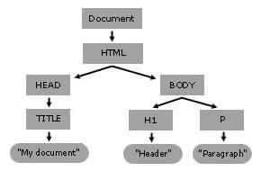

# What is Dom (Document Object Model)
 - It is a programming interface for web documents that allows programs and scripts to dynamically access and update the content, structure, and style of these documents.
 -Allows Javascript to interact with html document and make changes.
 -The DOM is created when the page loads from the HTML/CSS/JavaScript that the web server provides to the browser.

# Node
 - Are individual elements, attributes and text within html documents.
 - The inner node is called a child node, and the outer node is called a parent node. 
 
  dom programming is using JavaScript to:
-Ask the dom to find an HTML element or elements in the rendered page
-Remove the selected element(s) or add a new element next to the selected element
-Adjust a property of the selected element(s)

# Dom Tree 
  - Is a logical represetation of the dom structure.
  - Has Root , Parent node and child node.
  - Each of the tree ends in node and each node contains objects.
                
                
